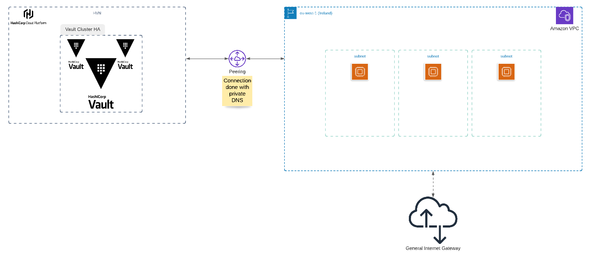

# AWS HCP Vault deployment

## This is an example Terraform code for HCP Vault deployment on AWS

| Resources               | Default Settings                    |
| ----------------------- | ----------------------------------- |
| VPC                     | CIDR: 10.220.0.0/16                 |
| Subnet                  | CIDR: 10.220.0.0/24                 |
| Network Interface       | No specific setting                 |
| Internet Gateway        | No specific setting                 |
| Route Table             | CIDR: 0.0.0.0/0                     |
| Route Table Association | No specific setting                 |
| Security Group          | SSH: 0.0.0.0/0, Egress: TCP->8200   |
| EC2                     | t2.micro, ubuntu 20.04 on eu-west-1 |
| HVN                     | CIDR: 172.25.16.0/20                |
| Vault                   | No public endpoint                  |

## Architecture

